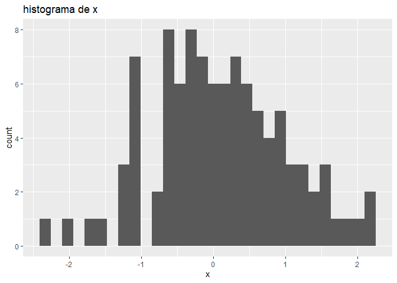
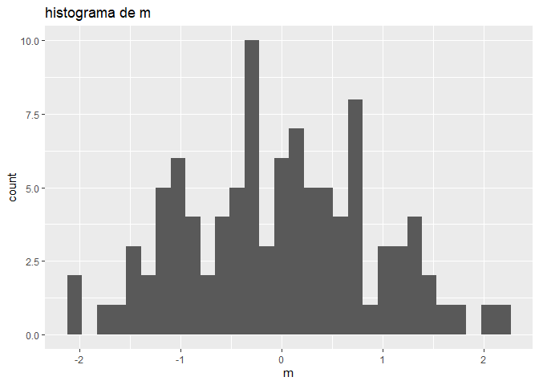
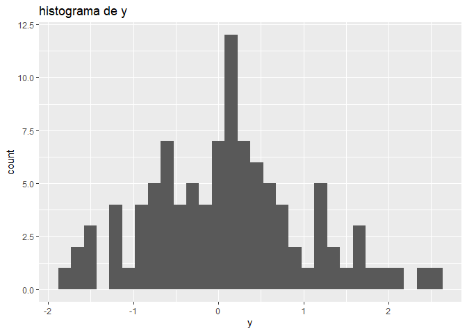
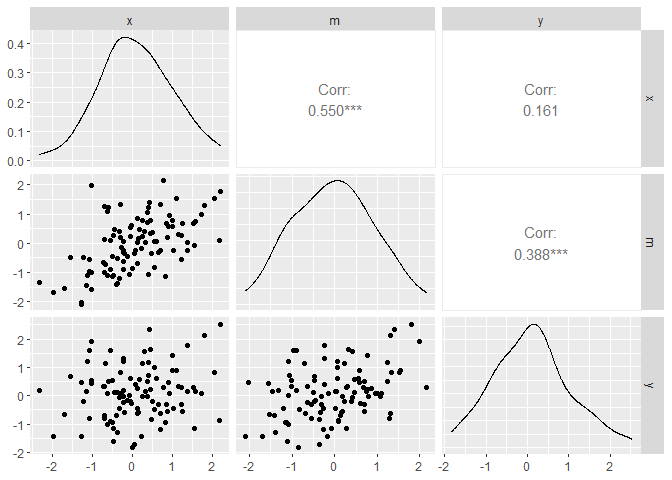
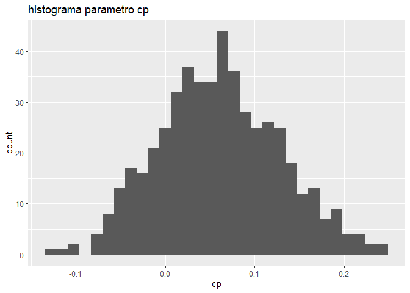
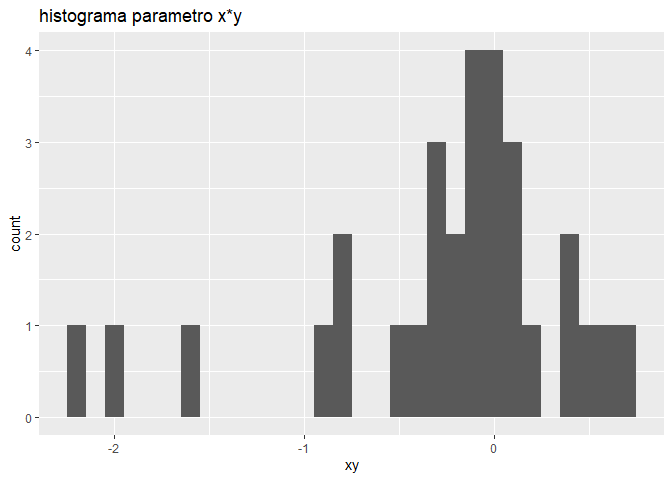
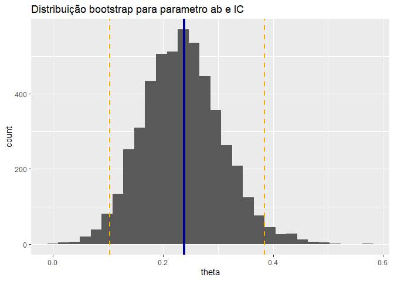
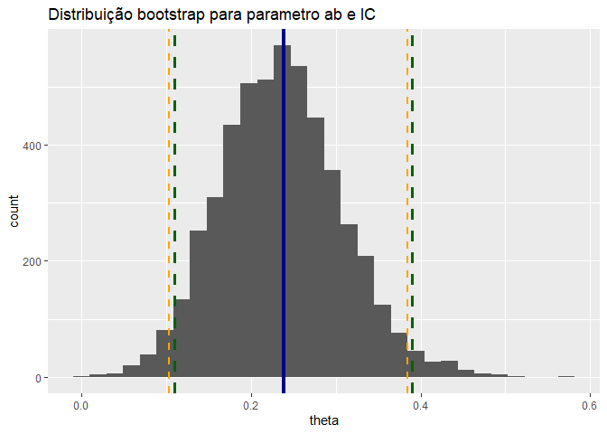
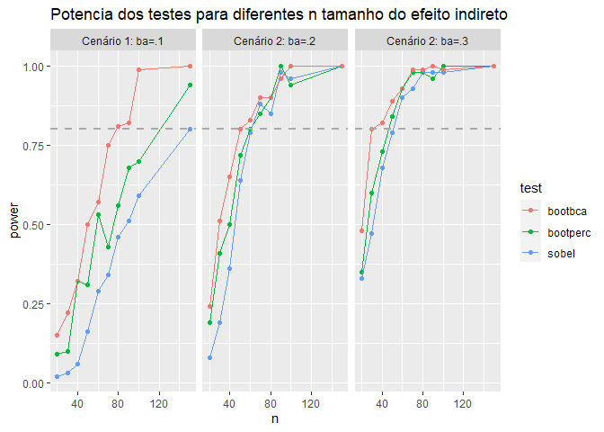
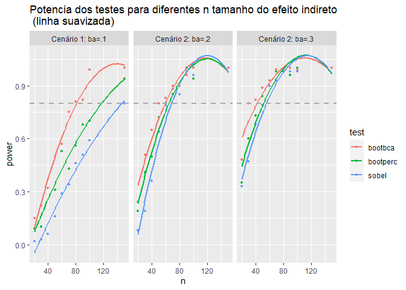

Utilização do Bootstrap para Teste Hipóteses sobre Efeitos Indiretos
================
Ana Machado, Ana Paquete, & Tiago Ferreira

# Objetivos

# Parte 1: Introdução à mediação e efeitos indiretos

Em estatística, um modelo de mediação permite identificar e explicar um
**efeito da variável independente (X) sobre a variável dependente (Y)
por meio da inclusão de uma terceira variável denominada variável
mediadora (M)**. Segundo Baron e Kenny, uma variável é designada de
mediadora “*na medida em que ela explica/é responsável pela relação
entre o preditor e o resposta*” 

Na figura anterior são denotados os efeitos intervenientes num modelo
mediação em que *c* representa o efeito total, isto é, o efeito causado
por X em Y, *cp* designa-se por efeito parcial, este considera a
inclusão da variável mediadora no modelo, correspondendo à relação
direta entre a variável independente e dependente, mantendo fixo M. Ou
seja, é o efeito de X em Y devido a outras causas que não a mediadora.
Pelo facto de considerar a mediadora, *cp* difere de *c*, pois
correspondem a relações diferentes. O efeito indireto envolve as letras
*a* e *b*. Enquanto *a* representa o efeito da variável independente na
variável mediadora, *b* representa o efeito da variável mediadora na
variável dependente, mantendo fixa a variável independente. O efeito
total é a soma dos efeitos diretos e indiretos.

Neste modelo de mediação, há dois caminhos para a variável dependente. A
variável independente deve prever a variável dependente, e a variável
independente deve prever o mediador. A mediação é testada através de
três regressões:

A metodologia mais utilizada para a análise de mediação é conhecida por
métodos dos quatro passos. Genericamente analisam as equações de
regressão estimadas, de forma a verificar, em cada passo, se os seus
coeficientes são estatisticamente significativos. De uma forma sucinta:

-   verificar a significância estatística do coeficiente *c*, através da
    equação (1);  
-   verificar a significância estatística do coeficiente *a*, através da
    equação (2);  
-   verificar a significância estatística do coeficiente *b*, através da
    equação (3), quando fixo X, .
-   verificar a significância estatística do coeficiente *cp*, através
    da equação (3), quando fixo M.

Dizemos que a mediação é total quando a estimativa de *cp* é nula,
indicando que o efeito da variável independente na variável dependente é
explicado apenad pela variável mediadora. Na mediação parcial a
estimativa de *cp* é inferior à estimativa de *c* (em valor absoluto).

Porém, outros autores como por exemplo Preacher e Hayes (2010),
utilizaram métodos alternativos para estimar os coeficientes e verificar
a sua significância. Para estimar o efeito de mediação (indireto) é
referido o método do produto dos coeficientes (*ab*), acompanhado pelo
respetivo teste de significância. Este teste de significância conjunta
para o efeito indireto definido como o produto de coeficientes é baseado
na distribuição do produto de coeficientes. No entanto, o método
bootstrap é o mais recomendado.

A título de curiosidade, deixamos aqui alguns exemplos de aplicações da
análise de mediação:  
- <https://www.sciencedirect.com/science/article/pii/S231472101500002X>

-   <https://www.thelancet.com/pdfs/journals/lanplh/PIIS2542-5196(21)00235-7.pdf>

-   <https://www.thelancet.com/pdfs/journals/lanpub/PIIS2468-2667(20)30292-9.pdf>

-   <https://www.thelancet.com/pdfs/journals/eclinm/PIIS2589-5370(21)00483-1.pdf>

-   <https://eng.uber.com/mediation-modeling/>

------------------------------------------------------------------------

# Parte 2: Simulação dos dados

Um modelo de mediação pressupõe duas variáveis preditoras (*x* e *m*) e
duas variáveis dependentes (*m* e *y*). A estimação deste modelo pode
ser feita através do método dos mínimos quadrados em duas etapas. Na
**primeira etapa** regredimos o mediador (*m*) na variável preditora
(*x*) para obter o parâmetro *a*<sub>*x**m*</sub>. Na **segunda etapa**
regredimos a variável dependente (*y*) em *x* e *m* para obtermos os
parâmetros *c**p*<sub>*x**y*\|*m*</sub> e *b*<sub>*m**y*\|*x*</sub>,
respetivamente. O produto de *a*<sub>*x**m*</sub> e
*b*<sub>*m**y*\|*x*</sub> é depois calculado, verificando-se se é
significativamente diferente de zero.

Assim os parametros *a*<sub>*x**m*</sub> e *c*<sub>*x**y*</sub> são
coeficientes brutos, enquanto que os coeficientes
*b*<sub>*m**y*\|*x*</sub> e *c**p*<sub>*x**y*\|*m*</sub> são
coeficientes ajustados. O parâmetro *a*<sub>*x**m*</sub> representa a
correlação entre as variáveis *x* e *m* enquanto o parâmetro
*c*<sub>*x**y*</sub> representa a correlação entre *x* e *y*, também
denominado de efeito total. O efeito direto de *x* sobre *y* é dado pelo
parâmetro *c**p*<sub>*x**y*\|*m*</sub>, correspondente á correlação
parcial entre *x* e *y* da *m*. *b*<sub>*m**y*\|*x*</sub>,
necessariamente não nulo numa mediação, representa o efeito de *m* sobre
*y*, quando controlando o efeito de *x*. Finalmente, temos o efeito
indireto de *x* sobre *y* (ab) dado pelo produto dos coeficientes
*a*<sub>*x**m*</sub> e *b*<sub>*m**y*\|*x*</sub>.

Assim, temos que:  

de onde: e

Para simular um modelo de mediação é necessário portanto definir 3
parâmetros á priori, nomeadamente *a*<sub>*x**m*</sub> e
*b*<sub>*m**y*\|*x*</sub> e *c*<sub>*x**y*</sub> ou
*c**p*<sub>*x**y*\|*m*</sub>. Para desenvolver a simulação dos nosso
dados utilizamos valores estandardizados dos parâmetros de regressão.
Neste contexto, os parâmetros poderiam variar entre -1 e 1. Assume-se
assim que os seguintes parâmetros são conhecidos.  
*a*<sub>*x**m*</sub> = 0.6  
*b*<sub>*m**y*\|*x*</sub> = 0.4  
*c*<sub>*x**y*</sub> = 0.3

Sabemos pela regra multiplicativa dos parâmetros que
*a**b* = 0.6 \* 0.4 = 0.24 e sabemos igualmente que
*c**p*<sub>*x**y*\|*m*</sub> = 0.3 − 0.24 = 0.06. Começamos por gerar
dados para *x*, assumindo que esta variável segue uma distribuição
normal com média 0 e variância 1, *x*∼ *N*(0, 1). No R geramos *x* com a
função **rnorm**. O tamanho de amostra foi fixado a 100 (*n* = 100).

``` r
n  <-  100
a <-  .6
b <-  .4
c <-  .3
ab <-  a*b # regra multiplicativa a*b = c-cp
cp <-  c-ab
set.seed(123)
x <- rnorm(n)
ggplot(data.frame(x=x), aes(x=x)) + geom_histogram() + labs(title="histograma de x")
```

    ## `stat_bin()` using `bins = 30`. Pick better value with `binwidth`.

<!-- -->

``` r
summary(x)
```

    ##     Min.  1st Qu.   Median     Mean  3rd Qu.     Max. 
    ## -2.30917 -0.49385  0.06176  0.09041  0.69182  2.18733

Tendo *x* podemos agora estimar os valores de *m* através do seguinte
modelo de regressão simples:  

*ε*<sub>*m*</sub>, a **variância residual ou erro do modelo**, segue uma
distribuição normal com média 0 e variância constante *σ*<sup>2</sup>,
*ε*<sub>*m*</sub>∼ *N*(0, *σ*<sup>2</sup>). Para mantermos a variância
total em 1 calculou-se *σ*<sup>2</sup> através da seguinte fórmula:

**Nota:** Usamos o quadrado do peso de regressão estandardizado para
obter a variância explicada pelo modelo e subtraímos esse valor a 1 para
obter a variância não explicada ou erro do modelo. A raiz quadrada é
empregue para manter a estandardização da variância. No R, a computação
de *m* é feita através do seguinte código.

``` r
em <- sqrt(1-a^2)

m = a*x + em*rnorm(n) # Variância aleatória com média 0 e SD 1
ggplot(data.frame(m=m), aes(x=m)) + geom_histogram() + labs(title="histograma de m")
```

    ## `stat_bin()` using `bins = 30`. Pick better value with `binwidth`.

<!-- -->

Finalmente, aalculam-se os valores de *y* pelo seguinte modelo de
regressão:

Para calcular a variância do erro, sabendo que
*v**a**r*(*x* + *m*) = *v**a**r*(*x*) + *v**a**r*(*m*) + 2*c**o**v*(*x**m*),
e para manter *y*∼ *N*(0, 1), empregamos seguinte fórmula:

Uma boa intuição para o parâmetro *σ*<sub>*y*</sub><sup>2</sup> é dada
pelas regras de pistas propostas por Wright ([*Wright’s tracing
rule*](https://en.wikipedia.org/wiki/Path_analysis_(statistics)#Path_tracing_rules)).
Sabendo isto, o processo de gerar dados para *y* torna-se relativamente
direto.

``` r
# Y follows a normal distribution, Y ∼ N (0; 1)
ey = sqrt(1-(cp^2 + b^2 + 2*a*cp*b) )
y = cp*x + b*m + ey*rnorm(n)

ggplot(data.frame(y=y), aes(x=y)) + geom_histogram() + labs(title="histograma de y")
```

    ## `stat_bin()` using `bins = 30`. Pick better value with `binwidth`.

<!-- -->

Os dados criados parecem consistentes com os valores dos parâmetros das
distribuições pretendidos.

<div class="container st-container"><table class="table table-striped table-bordered st-table st-table-striped st-table-bordered st-multiline ">
  <thead>
    <tr>
      <th align="center" class="st-protect-top-border"><strong>Variable</strong></th>
      <th align="center" class="st-protect-top-border"><strong>Stats / Values</strong></th>
      <th align="center" class="st-protect-top-border"><strong>Freqs (% of Valid)</strong></th>
      <th align="center" class="st-protect-top-border"><strong>Graph</strong></th>
    </tr>
  </thead>
  <tbody>
    <tr>
      <td align="left">x
[numeric]</td>
      <td align="left" style="padding:8;vertical-align:middle"><table style="border-collapse:collapse;border:none;margin:0"><tr style="background-color:transparent"><td style="padding:0;margin:0;border:0" align="left">Mean (sd) : 0.1 (0.9)</td></tr><tr style="background-color:transparent"><td style="padding:0;margin:0;border:0" align="left">min &le; med &le; max:</td></tr><tr style="background-color:transparent"><td style="padding:0;margin:0;border:0" align="left">-2.3 &le; 0.1 &le; 2.2</td></tr><tr style="background-color:transparent"><td style="padding:0;margin:0;border:0" align="left">IQR (CV) : 1.2 (10.1)</td></tr></table></td>
      <td align="left" style="vertical-align:middle">100 distinct values</td>
      <td align="left" style="vertical-align:middle;padding:0;background-color:transparent;"></td>
    </tr>
    <tr>
      <td align="left">m
[numeric]</td>
      <td align="left" style="padding:8;vertical-align:middle"><table style="border-collapse:collapse;border:none;margin:0"><tr style="background-color:transparent"><td style="padding:0;margin:0;border:0" align="left">Mean (sd) : 0 (0.9)</td></tr><tr style="background-color:transparent"><td style="padding:0;margin:0;border:0" align="left">min &le; med &le; max:</td></tr><tr style="background-color:transparent"><td style="padding:0;margin:0;border:0" align="left">-2.1 &le; 0 &le; 2.1</td></tr><tr style="background-color:transparent"><td style="padding:0;margin:0;border:0" align="left">IQR (CV) : 1.3 (-29.1)</td></tr></table></td>
      <td align="left" style="vertical-align:middle">100 distinct values</td>
      <td align="left" style="vertical-align:middle;padding:0;background-color:transparent;"></td>
    </tr>
    <tr>
      <td align="left">y
[numeric]</td>
      <td align="left" style="padding:8;vertical-align:middle"><table style="border-collapse:collapse;border:none;margin:0"><tr style="background-color:transparent"><td style="padding:0;margin:0;border:0" align="left">Mean (sd) : 0.1 (0.9)</td></tr><tr style="background-color:transparent"><td style="padding:0;margin:0;border:0" align="left">min &le; med &le; max:</td></tr><tr style="background-color:transparent"><td style="padding:0;margin:0;border:0" align="left">-1.8 &le; 0.1 &le; 2.5</td></tr><tr style="background-color:transparent"><td style="padding:0;margin:0;border:0" align="left">IQR (CV) : 1.1 (9.1)</td></tr></table></td>
      <td align="left" style="vertical-align:middle">100 distinct values</td>
      <td align="left" style="vertical-align:middle;padding:0;background-color:transparent;"></td>
    </tr>
  </tbody>
</table></div>

Da mesma forma, o padrão de correlações mostram-se consistentes com os
parâmetros de regressão definidos inicialmente

``` r
ggpairs(df1) 
```

<!-- -->

Recorremos a uma simulação Monte Carlo para confirmar que o processo de
geração de dados adotado está correto. O nosso objetivo com o processo
seguinte era de perceber se com um número razoável de simulações (para
fins académicos usamos n=500, embora na prática este número deverá ser
bastante mais elevado) a estimação dos parâmetros de regressão
convergiam para os valores de estimativa verdadeiro, isto é:  
*a*<sub>*x**m*</sub> = 0.6  
*b*<sub>*m**y*\|*x*</sub> = 0.4  
*c*<sub>*x**y*</sub> = 0.3  
Para tornar mais eficiente o processo de simulação recorremos ao pacote
**[simglm](https://cran.r-project.org/web/packages/simglm/index.html)**.
Este pacote segue os passos apresentados anteriormente no entanto
permite simular dados de uma forma mais flexível e computacionalmente
eficaz. Começamos por gerar valores para *x* assumindo que
*x*∼ *N*(0, 1).

``` r
n  <-  200
a <-  .6
b <-  .4
c <-  .3
ab <-  a*b # regra multiplicativa a*b = c-cp
cp <-  c-ab #cp = c'

library(simglm)
sim_arguments <- list(
  formula = y ~ 1 + x,
  fixed = list(x = list(var_type = 'continuous', 
                         mean = 0, sd = 1)),
  sample_size = 200
)

dfsim_x <- simulate_fixed(data = NULL, sim_arguments)
```

``` r
ggplot(dfsim_x, aes(x=x)) + geom_histogram() + labs(title="histograma de x")
```

    ## `stat_bin()` using `bins = 30`. Pick better value with `binwidth`.

<!-- -->

Com base nos valores de *x* gerados aleatoriamente, computamos *m*
recorrendo às equações 7 e 8.

``` r
# simulação da var(em)
sim_arguments <- list(
  error = list(variance = sqrt(1-a^2)),
  sample_size = 200
)

dfsim_em <- simulate_error(data = NULL, sim_arguments)
```

``` r
# simulação de m
sim_arguments <- list(
  formula = m ~ 1 + x,
  fixed = list(x = list(var_type = 'continuous', mean = 0, sd = 1)),
  error = list(variance = sqrt(1-a^2)),
  sample_size = 200,
  reg_weights = c(0,a)
)

simulate_fixed(data = NULL, sim_arguments) %>%
  simulate_error(sim_arguments) %>%
  generate_response(sim_arguments) %>% 
  model_fit(sim_arguments) %>%
  extract_coefficients()
```

    ## # A tibble: 2 x 5
    ##   term        estimate std.error statistic  p.value
    ##   <chr>          <dbl>     <dbl>     <dbl>    <dbl>
    ## 1 (Intercept)   0.0480    0.0657     0.731 4.65e- 1
    ## 2 x             0.570     0.0637     8.95  2.59e-16

``` r
data_m <- simulate_fixed(data = NULL, sim_arguments) %>%
  simulate_error(sim_arguments) %>%
  generate_response(sim_arguments) 

head(data_m)
```

    ##   X.Intercept.          x level1_id      error fixed_outcome random_effects
    ## 1            1  0.9159921         1 -0.6705751    0.54959523              0
    ## 2            1  0.8006224         2 -0.2876532    0.48037341              0
    ## 3            1 -0.9365690         3 -1.0265974   -0.56194142              0
    ## 4            1 -1.4007874         4  0.3169422   -0.84047246              0
    ## 5            1  0.1602775         5  0.3799525    0.09616652              0
    ## 6            1 -0.2739624         6  0.5798995   -0.16437742              0
    ##            m
    ## 1 -0.1209799
    ## 2  0.1927202
    ## 3 -1.5885388
    ## 4 -0.5235302
    ## 5  0.4761190
    ## 6  0.4155221

Finalmente, usando as equações 9 e 10, simulamos valores de *y*.

``` r
sim_arguments <- list(
  formula =  y ~ 1 + x + m,
  error = list(variance = sqrt(1-(cp^2 + b^2 + 2*a*cp*b))),
  sample_size = 200,
  reg_weights = c(cp, b)
)

simulate_error(data = data_m[,c(2,7)], sim_arguments) %>%
  generate_response(sim_arguments) %>% 
  model_fit(sim_arguments) %>%
  extract_coefficients()
```

    ## # A tibble: 3 x 5
    ##   term        estimate std.error statistic       p.value
    ##   <chr>          <dbl>     <dbl>     <dbl>         <dbl>
    ## 1 (Intercept)   0.0584    0.0670     0.872 0.384        
    ## 2 x             0.0480    0.0850     0.564 0.573        
    ## 3 m             0.459     0.0751     6.11  0.00000000514

``` r
df2 <- simulate_error(data = data_m[,c(2,7)], sim_arguments) %>%
  generate_response(sim_arguments)
```

Com esperado, verificamos, para uma amostra simulada, que os resultados
obtidos com o pacote *simglm* são equivalentes ao obtidos anteriormente,
usando usando funções base do R.

<div class="container st-container"><table class="table table-striped table-bordered st-table st-table-striped st-table-bordered st-multiline ">
  <thead>
    <tr>
      <th align="center" class="st-protect-top-border"><strong>Variable</strong></th>
      <th align="center" class="st-protect-top-border"><strong>Stats / Values</strong></th>
      <th align="center" class="st-protect-top-border"><strong>Freqs (% of Valid)</strong></th>
      <th align="center" class="st-protect-top-border"><strong>Graph</strong></th>
    </tr>
  </thead>
  <tbody>
    <tr>
      <td align="left">x
[numeric]</td>
      <td align="left" style="padding:8;vertical-align:middle"><table style="border-collapse:collapse;border:none;margin:0"><tr style="background-color:transparent"><td style="padding:0;margin:0;border:0" align="left">Mean (sd) : 0 (1)</td></tr><tr style="background-color:transparent"><td style="padding:0;margin:0;border:0" align="left">min &le; med &le; max:</td></tr><tr style="background-color:transparent"><td style="padding:0;margin:0;border:0" align="left">-2.3 &le; 0 &le; 3.2</td></tr><tr style="background-color:transparent"><td style="padding:0;margin:0;border:0" align="left">IQR (CV) : 1.3 (-88.5)</td></tr></table></td>
      <td align="left" style="vertical-align:middle">200 distinct values</td>
      <td align="left" style="vertical-align:middle;padding:0;background-color:transparent;"></td>
    </tr>
    <tr>
      <td align="left">m
[numeric]</td>
      <td align="left" style="padding:8;vertical-align:middle"><table style="border-collapse:collapse;border:none;margin:0"><tr style="background-color:transparent"><td style="padding:0;margin:0;border:0" align="left">Mean (sd) : 0 (1.1)</td></tr><tr style="background-color:transparent"><td style="padding:0;margin:0;border:0" align="left">min &le; med &le; max:</td></tr><tr style="background-color:transparent"><td style="padding:0;margin:0;border:0" align="left">-2.6 &le; 0 &le; 2.9</td></tr><tr style="background-color:transparent"><td style="padding:0;margin:0;border:0" align="left">IQR (CV) : 1.3 (133.5)</td></tr></table></td>
      <td align="left" style="vertical-align:middle">200 distinct values</td>
      <td align="left" style="vertical-align:middle;padding:0;background-color:transparent;"></td>
    </tr>
    <tr>
      <td align="left">y
[numeric]</td>
      <td align="left" style="padding:8;vertical-align:middle"><table style="border-collapse:collapse;border:none;margin:0"><tr style="background-color:transparent"><td style="padding:0;margin:0;border:0" align="left">Mean (sd) : 0 (1.1)</td></tr><tr style="background-color:transparent"><td style="padding:0;margin:0;border:0" align="left">min &le; med &le; max:</td></tr><tr style="background-color:transparent"><td style="padding:0;margin:0;border:0" align="left">-3.6 &le; 0.1 &le; 2.7</td></tr><tr style="background-color:transparent"><td style="padding:0;margin:0;border:0" align="left">IQR (CV) : 1.5 (22.1)</td></tr></table></td>
      <td align="left" style="vertical-align:middle">200 distinct values</td>
      <td align="left" style="vertical-align:middle;padding:0;background-color:transparent;"></td>
    </tr>
  </tbody>
</table></div>

``` r
ggpairs(df2[, c("x", "m", "y")]) 
```

<!-- -->

Procedemos, realizando um estudo de Monte Carlo para verificar **em que
medida os parâmetros estimados pelos modelos de regressão definidos
convergem para os parâmetros verdadeiros com o aumento do número de
simulações**. Começamos por realizar este estudo tendo em vista o
parâmetro *a*<sub>*x**m*</sub> = 0.6. O pacote **simglm** permite gerar
aleatoriamente dados com base nas especificações pré-definidas do
modelo. Assim, usando a função **simglm::replicate\_simulation**, para
fins de exercício académico, ajustamos o modelo de regressão apenas a
500 amostras.

``` r
set.seed(1234) 
sim_arguments_1 <- list(
  formula =  m ~ 1 + x,
  fixed = list(x = list(var_type = 'continuous', mean = 0, sd = 1)),
  error = list(variance = sqrt(1-a^2)),
  sample_size = 200,
  reg_weights = c(0,a),
  model_fit = list(formula = m ~ 1 + x,
                   model_function = 'lm'),
  reg_weights_model = c(0,a),
  replications = 500,
  extract_coefficients = TRUE
)

dfsim_m_rep <- replicate_simulation(sim_arguments_1) 
head(dfsim_m_rep)
```

    ## [[1]]
    ## # A tibble: 2 x 5
    ##   term        estimate std.error statistic  p.value
    ##   <chr>          <dbl>     <dbl>     <dbl>    <dbl>
    ## 1 (Intercept)   0.0989    0.0647      1.53 1.28e- 1
    ## 2 x             0.531     0.0630      8.43 7.00e-15
    ## 
    ## [[2]]
    ## # A tibble: 2 x 5
    ##   term        estimate std.error statistic  p.value
    ##   <chr>          <dbl>     <dbl>     <dbl>    <dbl>
    ## 1 (Intercept)  -0.0117    0.0655    -0.179 8.58e- 1
    ## 2 x             0.656     0.0707     9.29  2.88e-17
    ## 
    ## [[3]]
    ## # A tibble: 2 x 5
    ##   term        estimate std.error statistic  p.value
    ##   <chr>          <dbl>     <dbl>     <dbl>    <dbl>
    ## 1 (Intercept)    0.107    0.0667      1.60 1.12e- 1
    ## 2 x              0.735    0.0711     10.3  2.50e-20
    ## 
    ## [[4]]
    ## # A tibble: 2 x 5
    ##   term        estimate std.error statistic  p.value
    ##   <chr>          <dbl>     <dbl>     <dbl>    <dbl>
    ## 1 (Intercept)  -0.0325    0.0638    -0.510 6.11e- 1
    ## 2 x             0.621     0.0647     9.60  3.80e-18
    ## 
    ## [[5]]
    ## # A tibble: 2 x 5
    ##   term        estimate std.error statistic  p.value
    ##   <chr>          <dbl>     <dbl>     <dbl>    <dbl>
    ## 1 (Intercept)   0.0439    0.0600     0.732 4.65e- 1
    ## 2 x             0.622     0.0575    10.8   1.01e-21
    ## 
    ## [[6]]
    ## # A tibble: 2 x 5
    ##   term        estimate std.error statistic  p.value
    ##   <chr>          <dbl>     <dbl>     <dbl>    <dbl>
    ## 1 (Intercept)  -0.0643    0.0610     -1.05 2.93e- 1
    ## 2 x             0.787     0.0619     12.7  1.95e-27

Criamos a função **simcoef** para extrair o parâmetro alvo
(*a*<sub>*x**m*</sub>) e calcular a sua distribuição.

``` r
simcoef <- function(listsim,
                    parameter = "x",
                    value = "estimate") {
  list_coef <- lapply(listsim, as.data.frame)
  coefs <- as.numeric()
  for (i in 1:length(list_coef)) {
    coefs[i] <- list_coef[[i]][list_coef[[i]]$term == parameter, value]
  }
  return(coefs)
}

mean(simcoef(dfsim_m_rep))
```

    ## [1] 0.6035231

``` r
ggplot(data.frame(a=simcoef(dfsim_m_rep)), aes(x=a)) + geom_histogram() + labs(title="histograma parametro a")
```

    ## `stat_bin()` using `bins = 30`. Pick better value with `binwidth`.

<!-- -->

Repetimos o procedimento anterior para as estimativas de *y* dado *x* e
*m*, também para *n* = 500.

``` r
set.seed(321) 

sim_arguments_2 <- list(
  formula =  y ~ 1 + x + m,
  fixed = list(x = list(var_type = 'continuous', mean = 0, sd = 1),
               m = list(var_type = 'continuous', mean = 0, sd = 1)),
  error = list(variance = sqrt(1-(cp^2 + b^2 + 2*a*cp*b))),
  sample_size = 200,
  reg_weights = c(0,cp, b),
  model_fit = list(formula = y ~ 1 + x + m,
                   model_function = 'lm'),
  reg_weights_model = c(0,cp, b),
  replications = 500,
  extract_coefficients = TRUE
)

dfsim_y_rep <- replicate_simulation(sim_arguments_2) 
head(dfsim_y_rep)
```

    ## [[1]]
    ## # A tibble: 3 x 5
    ##   term        estimate std.error statistic     p.value
    ##   <chr>          <dbl>     <dbl>     <dbl>       <dbl>
    ## 1 (Intercept)  -0.0543    0.0688    -0.789 0.431      
    ## 2 x             0.127     0.0707     1.79  0.0745     
    ## 3 m             0.335     0.0624     5.37  0.000000224
    ## 
    ## [[2]]
    ## # A tibble: 3 x 5
    ##   term        estimate std.error statistic  p.value
    ##   <chr>          <dbl>     <dbl>     <dbl>    <dbl>
    ## 1 (Intercept)  -0.0442    0.0672    -0.657 5.12e- 1
    ## 2 x             0.0906    0.0658     1.38  1.70e- 1
    ## 3 m             0.481     0.0718     6.71  2.07e-10
    ## 
    ## [[3]]
    ## # A tibble: 3 x 5
    ##   term        estimate std.error statistic      p.value
    ##   <chr>          <dbl>     <dbl>     <dbl>        <dbl>
    ## 1 (Intercept)   0.0566    0.0710     0.798 0.426       
    ## 2 x             0.0419    0.0737     0.569 0.570       
    ## 3 m             0.426     0.0770     5.54  0.0000000976
    ## 
    ## [[4]]
    ## # A tibble: 3 x 5
    ##   term        estimate std.error statistic    p.value
    ##   <chr>          <dbl>     <dbl>     <dbl>      <dbl>
    ## 1 (Intercept)  -0.129     0.0687    -1.87  0.0628    
    ## 2 x             0.0669    0.0702     0.954 0.341     
    ## 3 m             0.332     0.0722     4.60  0.00000754
    ## 
    ## [[5]]
    ## # A tibble: 3 x 5
    ##   term        estimate std.error statistic  p.value
    ##   <chr>          <dbl>     <dbl>     <dbl>    <dbl>
    ## 1 (Intercept)  -0.0142    0.0659    -0.215 8.30e- 1
    ## 2 x             0.0280    0.0634     0.442 6.59e- 1
    ## 3 m             0.457     0.0630     7.25  9.14e-12
    ## 
    ## [[6]]
    ## # A tibble: 3 x 5
    ##   term        estimate std.error statistic   p.value
    ##   <chr>          <dbl>     <dbl>     <dbl>     <dbl>
    ## 1 (Intercept)   0.0484    0.0742     0.652 0.515    
    ## 2 x             0.0684    0.0703     0.973 0.332    
    ## 3 m             0.319     0.0717     4.46  0.0000139

``` r
mean(simcoef(dfsim_y_rep, parameter="x"))
```

    ## [1] 0.06024269

``` r
ggplot(data.frame(cp=simcoef(dfsim_y_rep, parameter="x")), aes(x=cp)) + geom_histogram() + labs(title="histograma parametro cp")
```

    ## `stat_bin()` using `bins = 30`. Pick better value with `binwidth`.

<!-- -->

``` r
mean(simcoef(dfsim_y_rep, parameter="m"))
```

    ## [1] 0.3964892

``` r
ggplot(data.frame(b=simcoef(dfsim_y_rep, parameter="m")), aes(x=b)) + geom_histogram() + labs(title="histograma parametro b")
```

    ## `stat_bin()` using `bins = 30`. Pick better value with `binwidth`.

<!-- -->

A função **simglm::compute\_statistics** permite calcular a potencia e
probabilidade de erro do tipo 1, neste caso quando se estima este modelo
para amostras de *n* = 500.

``` r
compute_statistics(dfsim_m_rep, sim_arguments)
```

    ## # A tibble: 2 x 11
    ##   term        avg_estimate power avg_test_stat crit_value_power type_1_error
    ##   <chr>              <dbl> <dbl>         <dbl>            <dbl>        <dbl>
    ## 1 (Intercept)     -0.00314 0.038       -0.0468             1.96        0.16 
    ## 2 x                0.604   1            9.49               1.96        0.878
    ## # ... with 5 more variables: avg_adjtest_stat <dbl>, crit_value_t1e <dbl>,
    ## #   param_estimate_sd <dbl>, avg_standard_error <dbl>, precision_ratio <dbl>

``` r
compute_statistics(dfsim_y_rep, sim_arguments)
```

    ## # A tibble: 3 x 11
    ##   term        avg_estimate power avg_test_stat crit_value_power type_1_error
    ##   <chr>              <dbl> <dbl>         <dbl>            <dbl>        <dbl>
    ## 1 (Intercept)     0.000239 0.046     -0.000641             1.96        0.142
    ## 2 m               0.396    1          5.89                 1.96        0.998
    ## 3 x               0.0602   0.154      0.900                1.96        1    
    ## # ... with 5 more variables: avg_adjtest_stat <dbl>, crit_value_t1e <dbl>,
    ## #   param_estimate_sd <dbl>, avg_standard_error <dbl>, precision_ratio <dbl>

Verificamos, como esperado, que os valores das estimativas pelo método
Monte Carlo convergem para os valores da população quando o número de
amostras aumenta.

------------------------------------------------------------------------

# Parte 3: Teste de hipótese sobre o efeito indireto em mediação

Como já foi referido, na parte 1, a mediação é avaliada através de
equações lineares (1), (2) e (3), sendo o método dos quatro passos o
mais utilizado. Este método tem como objetivo analisar a significância
estatística dos efeitos envolvidos (efeito total, efeito indireto e
efeito direto) no modelo de mediação. Com isto, surge a desvantagem: o
facto de não fornecer um cálculo direto do efeito mais interessante na
mediação - o efeito indireto - avaliando apenas a presença ou ausência
de mediação. Consequentemente não existe nenhum teste direto para
avaliar a significância deste efeito, o qual se demonstra importante, ao
invés de se testar somente a significância dos coeficientes nos quatro
passos (MacKinnon, Cheong, & Pirlott, 2012).

A método do produto de coeficientes, no contexto do modelo de mediação
(Figura 1), baseia-se na definição do efeito mediado como a
multiplicação dos coeficientes de regressão *a* e *b*. Podemos assim
definir um intervalo de confiança para *ab* e se o zero pertencer ao
intervalo dado pela equação, o efeito não é estatisticamente
significativo (MacKinnon et al., 2012).

Onde *α* representa o nível de significância, $z\_{1-\\frac{α}{2}}$ o
quantil de probabilidade da distribuição Normal reduzida e
*s*<sub>*â**b̂*</sub> o erro padrão de *â**b̂*.

Para este processo, o teste de Sobel tem como objetivo verificar se o
efeito indireto é estatisticamente significativo, assumindo-se como
hipótese nula que o efeito é nulo. A avaliação da significância
estatística é possível calculando o rácio da estimativa do produto de
coeficientes pelo respetivo erro padrão. A conclusão final é obtida
comparando o rácio com o valor crítico da distribuição Normal padrão,
para um certo nível de significância (*α*) (MacKinnon et al., 2012).

A metodologia da diferença de coeficientes, no contexto do modelo de
mediação, baseia-se na definição do efeito de mediação como a subtração
dos coeficientes de regressão *c* e *cp*. A significância estatística do
efeito de mediação é possível de ser testada através do intervalo de
confiança para o efeito indireto A estatística de teste (um rácio) e o
valor crítico de uma distribuição Normal padrão, para um dado nível de
significância. O rácio apresenta como numerador a diferença entre os
efeitos total e direto e como denominador o erro padrão da mesma
diferença. A conclusão é idêntica ao teste de Sobel. Nestes métodos, do
produto e da diferença de coeficientes, assume-se que o efeito indireto
segue uma distribuição Normal, no entanto, isto nem sempre se verifica -
apenas em amostras de dimensão grande (MacKinnon et al., 2012).

O método Bootstrap pertence à classe da metodologia de Monte Carlo,
baseando-se na reamostragem com ou sem reposição, podendo ser um
procedimento não paramétrico. O parâmetro de interesse, neste contexto,
é o efeito indireto, sendo a sua estimação efetuada pelo método
Bootstrap não paramétrico. Consequentemente, não é necessário considerar
a distribuição amostral do efeito indireto como sendo uma distribuição
Normal (metodologias do produto e da diferença de coeficientes)
obtendo-se, ao invés, uma aproximação da distribuição, gerada
empiricamente. A distribuição empírica é obtida reamostrando a amostra
original *T* vezes, estimando-se em cada uma dessas reamostras, o efeito
indireto. Através da distribuição empírica para o efeito indireto é
possível obter o erro padrão deste efeito, o seu p-value e construir-lhe
intervalos de confiança (MacKinnon et al., 2012).

------------------------------------------------------------------------

# Parte 4: Análise comparativa dos teste de hipótese sobre o efeito indiretos

## Teste de Sobel

Como discutido na secção anterior do presente relatório, o teste de
Sobel é uma abordagem paramétrica à significância estatística do
parâmetro de efeitos indiretos no contexto do modelo de mediação.
Trata-se de um teste que tem por base uma distribuição z calculada
através da seguinte equação:

No teste Sobel o desvio médio da estimativa do efeito indireto é dado
pela seguinte equação:

Nesta equação *s*<sup>2</sup> representa a variância dos parâmetros
*a*<sub>*x**m*</sub> e *b*<sub>*m**y*\|*x*</sub>. As seguintes linhas de
código implementa o teste de Sobel no R. Para exemplificar utilizaremos
a base de dados **df1** (*n* = 100) gerada na parte 2 do presente
relatório.

**Passo 1:** Ajustamento dos modelos e extração dos coeficientes
*a*<sub>*x**m*</sub> e *b*<sub>*m**y*\|*x*</sub>

``` r
model1 <- lm(formula = m ~ x, data=df1)
summary(model1)
```

    ## 
    ## Call:
    ## lm(formula = m ~ x, data = df1)
    ## 
    ## Residuals:
    ##      Min       1Q   Median       3Q      Max 
    ## -1.52587 -0.54680 -0.06999  0.46451  2.63232 
    ## 
    ## Coefficients:
    ##             Estimate Std. Error t value Pr(>|t|)    
    ## (Intercept) -0.08224    0.07804  -1.054    0.295    
    ## x            0.55802    0.08550   6.526 2.98e-09 ***
    ## ---
    ## Signif. codes:  0 '***' 0.001 '**' 0.01 '*' 0.05 '.' 0.1 ' ' 1
    ## 
    ## Residual standard error: 0.7766 on 98 degrees of freedom
    ## Multiple R-squared:  0.303,  Adjusted R-squared:  0.2958 
    ## F-statistic: 42.59 on 1 and 98 DF,  p-value: 2.984e-09

``` r
a <- model1$coefficient[2]

model2 <- lm(formula = y ~ x + m, data=df1)
summary(model2)
```

    ## 
    ## Call:
    ## lm(formula = y ~ x + m, data = df1)
    ## 
    ## Residuals:
    ##     Min      1Q  Median      3Q     Max 
    ## -1.6832 -0.5938 -0.1118  0.5584  1.8691 
    ## 
    ## Coefficients:
    ##             Estimate Std. Error t value Pr(>|t|)    
    ## (Intercept)  0.12138    0.08640   1.405 0.163251    
    ## x           -0.07573    0.11274  -0.672 0.503388    
    ## m            0.42675    0.11120   3.838 0.000221 ***
    ## ---
    ## Signif. codes:  0 '***' 0.001 '**' 0.01 '*' 0.05 '.' 0.1 ' ' 1
    ## 
    ## Residual standard error: 0.8549 on 97 degrees of freedom
    ## Multiple R-squared:  0.1543, Adjusted R-squared:  0.1369 
    ## F-statistic: 8.852 on 2 and 97 DF,  p-value: 0.0002944

``` r
b <- model2$coefficient[3]
```

**Passo 2:** Extração dos desvio padrão (SE) das estimativas

``` r
SEa <- coef(summary(model1))[2, 2]
SEb <- coef(summary(model2))[3, 2]
```

**Passo 3:** Cálculo do desvio padrão do efeito indireto e estatística
do teste com recurso às equações 12 e 13.

``` r
SE <- sqrt(a^2*SEb^2 + b^2*SEa^2)
z <- a*b/SE
```

**Passo 4:** Cálculo da probabilidade associada ao valor do teste
calculado, tomando por referência uma distribuição z. Em alternativa,
comparar o valor absoluto da estatística do teste com o valor crítico da
distribuição z para um determinado *α*.

``` r
p <- pnorm(-abs(z)) * 2
# and not p <- 1-pnorm(z) as in paper

alpha=.05
sig <- qnorm(1-alpha/2) < abs(z)
```

Criamos a função *sobeltest*, com base nos passos anteriores, para
implementar automaticamente o teste de Sobel no R.

``` r
sobeltest <- function(data, x, m, y, alpha=.05){
#Passo 1
model1 <- lm(formula = m ~ x, data=data)
summary(model1)
a <- model1$coefficient[2]

model2 <- lm(formula = y ~ x + m, data=data)
summary(model2)
b <- model2$coefficient[3]

# Passo 2
SEa <- coef(summary(model1))[2, 2]
SEb <- coef(summary(model2))[3, 2]

# Passo 3
SE <- sqrt(a^2*SEb^2 + b^2*SEa^2)
z <- a*b/SE

# Passo 4
p <- pnorm(-abs(z)) * 2
# and not p <- 1-pnorm(z) as in paper

sig <- qnorm(1-alpha/2) < abs(z)
return(list(teststat=z, pvalue=p, sig=sig))
}

(test <- sobeltest(x, m, y, data=df1))
```

    ## $teststat
    ##       x 
    ## 3.30803 
    ## 
    ## $pvalue
    ##            x 
    ## 0.0009395481 
    ## 
    ## $sig
    ##    x 
    ## TRUE

### Limitações do teste de Sobel

Como discutido anteriormente (ver secção 3 do presente relatório), o
teste de Sobel assume o pressuposto de que o produto de duas variáveis
aleatórias normais apresenta uma distribuição também normal. No entanto,
este pressuposto é frequentemente violado na prática. Por conseguinte, a
multiplicação dos coeficientes de regressão *a*<sub>*x**m*</sub> e
*b*<sub>*m**y*\|*x*</sub> apresenta frequentemente uma distribuição que
se afasta da distribuição normal, caracterizada habitualmente por
elevada assimetria e curtose. O seguinte histograma representa a
distribuição de duas variáveis (x e y) aleatórias (*n* = 30) com
distribuição normal.

``` r
ggplot(data.frame(xy=rnorm(30)*rnorm(30)), aes(x=xy)) + geom_histogram() + labs(title="histograma parametro x*y")
```

    ## `stat_bin()` using `bins = 30`. Pick better value with `binwidth`.

<!-- -->

## Estimação da significância de efeitos indiretos através do método de bootstrap

Neste projeto implementamos dois tipos de bootstrap, o **bootstrap
percentílico** (percentile bootstrap method) e o **bootstrap com
correção de viés e fator de aceleração** (bias corrected e accelarated
bootstrap).

Para implementar estes dois métodos bootstrap foi necessário criar uma
função geradora das estimativas para o coeficiente *ab*. Usamos cálculo
matricial para encontrar o parâmetro ab, aplicando a seguinte equação
para estimação dos parâmetros de um modelo de regressão linear múltipla:

``` r
names(df1)
```

    ## [1] "x" "m" "y"

``` r
d <- as.matrix(cbind(int=rep(1, length(df1$x)), x=df1$x, m=df1$m, y=df1$y))
b <- solve(t(d[,1:3])%*%d[,1:3])%*%t(d[,1:3])%*%d[,4]
a <- solve(t(d[,1:2])%*%d[,1:2])%*%t(d[,1:2])%*%d[,3]
ab <- a[2,1]*b[3,1]
```

Com base na equação 14, criamos a função *stat\_function*, que será
utilizada no contexto do bootstrap para estimar os efeitos indiretos
**ab**.

``` r
head(df1)
```

    ##             x           m           y
    ## 1 -0.56047565 -0.90461064  1.58052260
    ## 2 -0.23017749  0.06740047  1.19257004
    ## 3  1.55870831  0.73787149  0.15039433
    ## 4  0.07050839 -0.23572904  0.39808874
    ## 5  0.12928774 -0.68372221 -0.63808471
    ## 6  1.71506499  0.99301681  0.07212389

``` r
stat_function <- function(df){
  d <- as.matrix(cbind(int=rep(1, dim(df)[1]), x=df[,"x"], m=df[,"m"], y=df[,"y"]))
  b <- solve(t(d[,1:3])%*%d[,1:3])%*%t(d[,1:3])%*%d[,4]
  a <- solve(t(d[,1:2])%*%d[,1:2])%*%t(d[,1:2])%*%d[,3]
  ab <- a[2,1]*b[3,1] 
  return(ab)
}
stat_function(df1)
```

    ##         x 
    ## 0.2381351

### Bootstrap Percentílico (Percentile Bootstrap Method)

A implementação do bootstrap percentílico no R é bastante direta.
Trata-se da abordagem bootstrap mais simples, permitindo calcular
intervalos de confiança entre $100\*(\\frac{\\alpha}{2})$ e
$100\*(1-\\frac{\\alpha}{2})$ da distribuição bootstrap gerada do
parâmetro *θ*. Esta distribuição obtém-se por método de re-amostragem
com reposição, sendo que *θ* representa o parâmetro de interesse e *α* o
nível de significância (Efron, 1982). Criamos a função *boot\_perc* para
implementar o bootstrap percentílico no R.

``` r
boot_perc <- function(data, R=5000, alpha = .05) {
  data <- as.matrix(data)
  est <- stat_function(data)
  n <- dim(data)[1]
  N <- 1:n
  res <- rep(NA, R)
  for (i in 1:R) {
    #Select a bootstrap sample
    id <- sample(n, replace = TRUE)
    #Estimate index
    res[i] <- stat_function(data[id, ])
  }
  limits <- quantile(res, c(alpha / 2, 1 - alpha / 2))
  CI <- c(limits[[1]], limits[[2]])
  sig <- 0 < prod(sign(CI)) # serve para ver se o intervalo de confiânça contem ou não zero
  return(list(
    estimate = est,
    bootdist=res,
    BootConfInt = limits,
    sig = sig
  ))
}
```

O seguinte histograma representa a distribuição bootstrap com base nos
dados da df1. Notar que esta base de dados foi gerada para resultar nos
seguintes parâmetros:

*a*<sub>*x**m*</sub> = 0.6  
*b*<sub>*m**y*\|*x*</sub> = 0.4  
*c*<sub>*x**y*</sub> = 0.3  
*a*<sub>*x**m*</sub>*b*<sub>*m**y*\|*x*</sub> = 0.24

``` r
testboot1 <- boot_perc(df1)
ggplot(data.frame(theta=testboot1[[2]]), aes(x=theta)) + 
  geom_histogram() + 
  labs(title="Distribuição bootstrap para parametro ab e IC") + 
  geom_vline(xintercept=testboot1[[1]], color = "darkblue", size=1.5) + 
  geom_vline(xintercept=testboot1[[3]][1], color = "orange", size=.8, linetype="dashed") +
  geom_vline(xintercept=testboot1[[3]][2], color = "orange", size=.8, linetype="dashed") 
```

    ## `stat_bin()` using `bins = 30`. Pick better value with `binwidth`.

<!-- -->

### Bootstrap com correção de viés e fator de aceleração (Bias corrected e accelarated bootstrap)

Duas limitações têm sido apontadas ao bootstrap percentílico.
**Primeiro**, não tem em conta os dados originais, resultando
exclusivamente da re-amostragem com reposição. **Segundo**, o bootstrap
percentílico não ajusta eventual assimetria da distribuição bootstrap.
Para abordar estas limitações é proposto o método bootstrap com correção
de viés e fator de aceleração (BCa) (Efron and Tibshirani, 1993). O BCa
tem a consideração e faz a correção do viés que pode decorrer de uma
eventual assimetria de distribuição bootstrap. *A presença de assimetria
em distribuições bootstrap é habitual*. Neste sentido, o BCa foi
desenvolvido para obter os intervalos de confiança com uma correção da
assimetria (Efron and Tibshirani, 1993). Para o desenvolvimento deste
método é necessário calcular uma constante de aceleração, denotada por
*a*, que é estimada pelo método Jackknife. O intervalo bootstrap para o
parametro *θ* tem a forma:

*Θ*(*z*), representa a função de distribuição da normal estandardizada  
*Z*<sub>0</sub> = *Θ*<sup> − 1</sup>(*F̂*(*θ̂*)) *Z*<sub>*u*</sub> =
*Θ*<sup> − 1</sup>(*u*) *a* é a constante de aceleração

A constante de aceleração *a* assume a seguinte forma:

*I*<sub>*i*</sub> exprime a influência de *x*<sub>*i*</sub> na
estimativa de *θ* sendo aproximada pelo método jackknife (Efron, 1987).

Implementamos esta abordagem no R, criando a função **boot\_cba**.

``` r
boot_bca <- function(data, R=5000, alpha = .05) {
  data <- as.matrix(data)
  n <- dim(data)[1]
  est <- stat_function(data) # cálculo do parâmetro amostral
  # o primero loop faz o bootstrap
  res <- rep(NA, R)
  for (i in 1:R) {
    #Select a bootstrap sample
    id <- sample(n, replace = TRUE)
    #Estimate index
    res[i] <- stat_function(data[id,])
  }
  #Calcular as constantes
  z0 <- qnorm(mean(res <= rep(est, R)))
  zc <- qnorm(c(alpha / 2, 1 - alpha / 2)) # Quantis pretendidos
  
  # este segundo faz o jackknife para estimar o parâmetro a (aceleração)
  I <- rep(NA, n)
  for (i in 1:n) {
    #Remove ith data point
    datanew <- data[-i, ]
    #Estimate theta - distribuição jackkife para todos os possíveis n-1
    theta_jack <- stat_function(datanew)
    I[i] <- (n - 1) * (est - theta_jack)
  }
  
  #calculo da constante de aceleração
  a <- 1 / 6 * (sum(I ^ 3) / sum(I ^ 2) ^ 1.5)
  
  # Calculo dos quantis ajustados
  adj.alpha <- pnorm(z0 + (z0 + zc) / (1 - a * (z0 + zc)))
  limits <- quantile(res, adj.alpha)
  CI <- c(limits[[1]], limits[[2]])
  sig <- 0 < prod(sign(CI)) # serve para ver se o intervalo de confiança contem ou não zero
  return(list(
    estimate = est,
    bootdist = res,
    BootConfInt = limits,
    sig = sig
  ))
}
```

``` r
testboot2 <- boot_bca(df1, R=5000)
lapply(testboot2, head)
```

    ## $estimate
    ##         x 
    ## 0.2381351 
    ## 
    ## $bootdist
    ## [1] 0.3012678 0.2858715 0.2224575 0.1938426 0.1435375 0.1777602
    ## 
    ## $BootConfInt
    ## 2.921667% 97.85236% 
    ## 0.1094053 0.3893537 
    ## 
    ## $sig
    ## [1] TRUE

O seguinte histograma representa a distribuição bootstrap com base nos
dados da df1, e os intervalos de confiança calculados através do
bootstrap percentílico e bootstrap com correção de viés e fator de
aceleração. Mais uma vez de notar que esta base de dados foi gerar para
resultar nos seguintes parâmetros:

*a*<sub>*x**m*</sub> = 0.6  
*b*<sub>*m**y*\|*x*</sub> = 0.4  
*c*<sub>*x**y*</sub> = 0.3  
*a*<sub>*x**m*</sub>*b*<sub>*m**y*\|*x*</sub> = 0.24

``` r
ggplot(data.frame(theta=testboot1[[2]]), aes(x=theta)) + 
  geom_histogram() + 
  labs(title="Distribuição bootstrap para parametro ab e IC") + 
  geom_vline(xintercept=testboot1[[1]], color = "darkblue", size=1.5) + 
  geom_vline(xintercept=testboot1[[3]][1], color = "orange", size=.8, linetype="dashed") +
  geom_vline(xintercept=testboot1[[3]][2], color = "orange", size=.8, linetype="dashed") + 
  geom_vline(xintercept=testboot2[[3]][1], color = "darkgreen", size=1.3, linetype="dashed") +
  geom_vline(xintercept=testboot2[[3]][2], color = "darkgreen", size=1.3, linetype="dashed") 
```

    ## `stat_bin()` using `bins = 30`. Pick better value with `binwidth`.

<!-- -->

## Análise da potências dos testes

Finalmente, analisamos a potência das três abordagens para cálculo da
significância de efeitos indiretos no contexto de um modelo de mediação,
nomeadamente teste de Sobel, bootstrap percentílico e bootstrap com
correção de viés e fator de aceleração.

A análise da potência permite, neste contexto verificar a
**probabilidade do teste encontrar um efeito significativo quando a
hipótese nula é falsa**, isto é quando existe efetivamente um efeito
indireto diferente de zero. Para realizar esta análise da potência do
teste simulamos várias experiências de em que o efeito indireto ab era
conhecido e diferente de zero. Verificamos depois, para um certo número
de replicações (para fins académicos n=100, embora na prática este
número deverá ser bastante mais elevado), a frequência com que o teste
detetou um efeito significativo para um *α* = .05. Para conduzir esta
análise do poder utilizamos as funções anteriormente criadas para
estimar o teste de Sobel, bootstrap percentílico e bootstrap com
correção de viés e fator de aceleração.

``` r
(testboot1 <- sobeltest(x=x, m=m, y=y, data=df1))
```

    ## $teststat
    ##       x 
    ## 3.30803 
    ## 
    ## $pvalue
    ##            x 
    ## 0.0009395481 
    ## 
    ## $sig
    ##    x 
    ## TRUE

``` r
testboot2 <- boot_perc(df1, R=5000)
lapply(testboot2, head)
```

    ## $estimate
    ##         x 
    ## 0.2381351 
    ## 
    ## $bootdist
    ## [1] 0.3782515 0.3900137 0.1739326 0.3682222 0.2240222 0.2132848
    ## 
    ## $BootConfInt
    ##      2.5%     97.5% 
    ## 0.1014454 0.3840891 
    ## 
    ## $sig
    ## [1] TRUE

``` r
testboot3 <- boot_bca(df1, R=5000)
lapply(testboot3, head)
```

    ## $estimate
    ##         x 
    ## 0.2381351 
    ## 
    ## $bootdist
    ## [1] 0.1652039 0.2574852 0.2100510 0.1703326 0.4043148 0.3073243
    ## 
    ## $BootConfInt
    ## 3.281781% 98.09213% 
    ## 0.1143951 0.3944450 
    ## 
    ## $sig
    ## [1] TRUE

A sintaxe para cálculo do poder foi adaptada de Caron & Valois (2018).

``` r
PowerMediation <- function(MediationTest, a = .25, b = .6, c = .0, n = 40, R =
                             100, alpha = 0.05){
  # Warning : This function can be excessively slow with high replication values and high sample sizes,
  # especially with bootstrap
  # MediationTest = SobelTest.R or BaronKenny.R or BootTest.R or any function returning an output labelled sig indicating if the result is significant (TRUE or FALSE)
  TestSIG <- rep(NA, R)
  for(j in 1:R){
    data <- GenerateMediationData(n=n, a=a, b=b, c=c)
    RES <- MediationTest(data=data, alpha=alpha)
    TestSIG[j] <- RES$sig
  }
  Power <- round(sum(TestSIG)/R,3)
  return(list(Results=TestSIG, Power=Power))
}
```

A análise da potência dos testes foi realizada sobre amostras com as
seguintes dimensões:  
n = {20, 30, 40, 50, 60, 70, 80, 90, 100, 150}

Os cenários para a análise foram os seguinte: &gt; Cenário 1:

*a*<sub>*x**m*</sub> = 0.335  
*b*<sub>*m**y*\|*x*</sub> = 0.300  
*c*<sub>*x**y*</sub> = 0.150  
*a*<sub>*x**m*</sub>*b*<sub>*m**y*\|*x*</sub> = 0.101

> Cenário 2:

*a*<sub>*x**m*</sub> = 0.500  
*b*<sub>*m**y*\|*x*</sub> = 0.400  
*c*<sub>*x**y*</sub> = 0.250  
*a*<sub>*x**m*</sub>*b*<sub>*m**y*\|*x*</sub> = 0.200

> Cenário 3:

*a*<sub>*x**m*</sub> = 0.600  
*b*<sub>*m**y*\|*x*</sub> = 0.500  
*c*<sub>*x**y*</sub> = 0.350  
*a*<sub>*x**m*</sub>*b*<sub>*m**y*\|*x*</sub> = 0.300

Os resultados desta análise da potência dos testes são apresentados nos
seguinte gráfico, o primeiro com a potência observada nas diferentes
condições e o segundo com uma suavização da reta.

``` r
load(file="power.Rdata")


ggplot(power_df, aes(x=n, y=power, color=test)) + 
  geom_point() +
  geom_line() + 
  facet_grid(cols = vars(condition)) + 
  ggtitle("Potencia dos testes para diferentes n tamanho do efeito indireto ") + 
  geom_hline(yintercept=.8, linetype="dashed", 
             color = "darkgrey", size=.8)
```

<!-- -->

``` r
ggplot(power_df) + 
  geom_point(aes(x=n, y=power, color=test), size=1)+
  geom_smooth(ymax=1,aes(x=n, y=power, color=test), method = "glm", formula = y ~ poly(x, 2), se = FALSE) + 
  facet_grid(cols = vars(condition)) +  
  ggtitle("Potencia dos testes para diferentes n tamanho do efeito indireto \n (linha suavizada)") + 
  geom_hline(yintercept=.8, linetype="dashed", 
             color = "darkgrey", size=.8)
```

<!-- -->

# Fontes bibliográficas

-   Baron, R. M., & Kenny, D. A. (1986). The moderator-mediator variable
    distinction in social psychological research: conceptual, strategic,
    and statistical considerations. *Journal of personality and social
    psychology*, 51(6), 1173–1182.
    <https://doi.org/10.1037//0022-3514.51.6.1173>

-   Bollen, K. A., & Stine, R. (1990). Direct and Indirect Effects:
    Classical and Bootstrap Estimates of Variability. *Sociological
    Methodology, 20*, 115–140. <https://doi.org/10.2307/271084>

-   Caron, Pier-Olivier, & Valois, Philippe (2018). A computational
    description of simple mediation analysis. *The Quantitative Methods
    for Psychology, 14* (2), 147-158.
    <https://doi.org/10.20982/tqmp.14.2.p147>

-   Efron, B. (1982). *The Jackknife, the bootstrap, and other
    resampling plans*. in CBMS-NSF Regional Conference Series in Applied
    Mathematics, Monograph 38 (Philadelphia, PA: SIAM). doi:
    10.1137/1.9781611970319

-   Efron, B., & Tibshirani, R. J. (1993). *An Introduction to the
    Bootstrap*. New York, NY: Chapman and Hall. doi:
    10.1007/978-1-4899-4541-9

-   Efron, B. (1987) Better Bootstrap Confidence Intervals. *Journal of
    the American Statistical Association*, 82:397, 171-185, DOI:
    10.1080/01621459.1987.10478410

-   Hayes, A. F., & Preacher, K. J. (2010). Quantifying and Testing
    Indirect Effects in Simple Mediation Models When the Constituent
    Paths Are Nonlinear. *Multivariate behavioral research*, 45(4),
    627–660. <https://doi.org/10.1080/00273171.2010.498290>

-   MacKinnon, D. P., Cheong, J., Pirlott, A. G. (2012) In Cooper, H.,
    Camic, P. M., Long, D. L., Panter, A. T., Rindskopf, D., Sher, K. J.
    (Eds.) (2012). *APA handbook of research methods in psychology*, Vol
    2: Research designs: Quantitative, qualitative, neuropsychological,
    and biological., (pp. 313-331). Washington, DC, US: American
    Psychological Association.

-   Preacher, K. J., Hayes, A. F. (2008). *Asymptotic and resampling
    strategies for assessing and comparing indirect effects in multiple
    mediator models*. Behavior Research Methods, 40 (3): pp 879-891.

-   Jose, P. E. (2013). *Doing statistical mediation and moderation*.
    Guilford Press.
